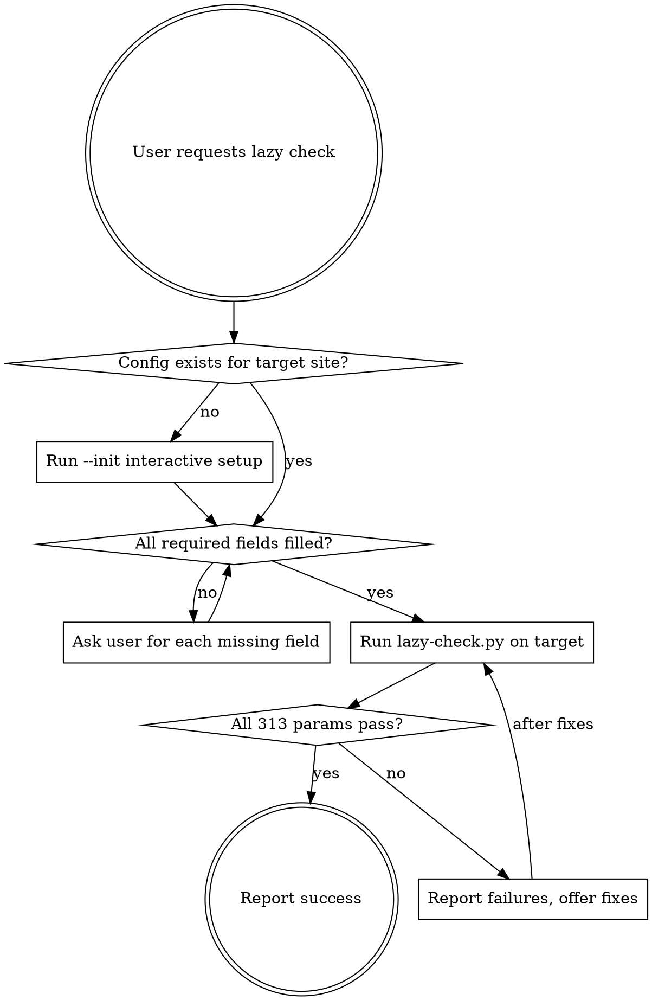

# Lazy Method — 313-Parameter Page QA

## Overview

Lazy Method audits a single page (or whole site) against ~313 binary pass/fail parameters across 15 categories. **Every parameter must pass** — no percentage thresholds. Based on the BMad 277-parameter system, adapted for 2026-2027 SEO/AI landscape.

**Core rule:** A page does not deploy until all parameters in all 15 categories pass.

## When to Use

Triggers include:
- "проверь по lazy method" / "check lazy method"
- "lazy check this page" / "audit this page"
- "run lazy method on X"
- Any request to QA a page against the full quality checklist

Do NOT use for:
- Quick single-parameter checks (just run the specific checker directly)
- Speed/performance audits (handled separately — would break pages)

## Location

Project tooling lives at the repo root:

```
/lazy-method/
  config-template.json       # universal config (not hardcoded per site)
  lazy-check.py              # master CLI runner
  interactive_setup.py       # --init mode (asks niche first)
  niche-profiles/            # per-niche defaults (schema type, thresholds, CRO rules)
    marketing-agency.json
    saas.json
    ecommerce.json
    restaurant.json
    local-service.json       # plumber, HVAC, appliance repair
    professional-service.json # law, accounting, consulting
    publisher.json            # blog, news
  checkers/                  # 15 per-category Python checkers (niche-aware)
  reports/                   # JSON output per run
```

Per-site config: `{site}/lazy-config.json`. Each site may be a **different niche** — config declares `business.niche` and `business.schema_type` to select the right profile.

Human-readable checklist: `docs/LAZY-METHOD-CHECKLIST.md`.

## Workflow



## Step 1: Identify target

If the user didn't specify a page or site, ask:

> Which page or site? (examples: `boomy/about.html`, `boomy/local/toronto/seo-agency/`, whole `boomy/` site)

## Step 2: Check config completeness

Before running, verify the target site has `{site}/lazy-config.json` with all required fields populated.

**Required fields (no defaults allowed):**
- `site.name`, `site.domain`, `site.language`, `site.country`
- `business.niche` (marketing-agency | saas | ecommerce | restaurant | local-service | professional-service | publisher | other)
- `business.schema_type` (auto-suggested from niche: LocalBusiness | Organization | Restaurant | LegalService | SoftwareApplication | etc.)
- `contact.email` (always required)
- `contact.phone` (required if `business.is_local === true`, else optional)
- `contact.address` (required if `business.is_local === true`)
- `business.founded_year`
- `business.review_count` and `business.rating` (required if present; pass 0 to explicitly skip)
- `brand.primary_color`, `brand.secondary_color`
- `rules.no_cross_link_domains` (if this is part of a site family)

**Niche-specific requirements** pulled from the chosen profile:
- SaaS → `product.pricing_tiers`, `product.trial_available`
- Restaurant → `menu.url`, `hours`, `cuisine_type`
- Local service → `service_area`, `emergency_available`
- E-commerce → `product_schema`, `shipping_policy`, `return_policy`

If config is missing or any required field is `null`/empty, **ask the user for each missing field one at a time**. Never silently fill with placeholder data.

Example:

> The site `newsite/` doesn't have `lazy-config.json` yet. I need a few details before running:
>
> **What is the site name?** (e.g., "Acme Marketing")

Save answers to `{site}/lazy-config.json`.

## Step 3: Run the check

```bash
# One page
python lazy-method/lazy-check.py --config={site}/lazy-config.json {site}/page.html

# Whole site
python lazy-method/lazy-check.py --config={site}/lazy-config.json --site={site}/

# Specific categories only
python lazy-method/lazy-check.py --categories=seo,schema,eeat --config=... {page}
```

Exit code 0 = all pass; exit code 1 = at least one failure.

## Step 4: Report

Present results by category, showing only failing parameters with location (file:line) and suggested fix. Don't dump passing checks — too noisy.

## 15 Categories (~313 params)

| # | Category | Params |
|---|---|---|
| 1 | SEO Optimization | 30 |
| 2 | Responsive Design | 80 |
| 3 | Cross-Browser | 28 |
| 4 | Visual Design (HTML-level only) | 20 |
| 5 | Accessibility (WCAG AA via axe-core) | 15 |
| 6 | Content Quality (Flesch-Kincaid, uniqueness) | 15 |
| 7 | CRO | 20 |
| 8 | Psychology (no fake urgency) | 20 |
| 9 | Data Consistency (phone/NAP/year match everywhere) | 15 |
| 10 | Conversion Design | 10 |
| 11 | **E-E-A-T signals** ⭐ | 15 |
| 12 | **GEO / AI Citations** ⭐ | 15 |
| 13 | **Schema.org 2026** ⭐ | 10 |
| 14 | **Brand Consistency** ⭐ (from config) | 10 |
| 15 | **Internal Linking** ⭐ | 10 |
| | **TOTAL** | **~313** |

⭐ = new for 2026-2027, not in original BMad.

**Excluded:** Speed Performance (do separately to avoid breaking pages), subjective photo quality checks (only HTML-level alt/src/lazy).

## Red Flags

Stop and ask if you see:
- User says "just check quickly" — Lazy Method is comprehensive, not quick. Confirm they want the full audit or a specific subset.
- Missing config fields — NEVER invent values. Always ask.
- User has no site config and no intent to create one — suggest running `--init` first.
- Target is a sitemap.xml or non-HTML file — Lazy Method audits rendered pages, not XML.

## Common Mistakes

| Mistake | Fix |
|---|---|
| Running without `--config` | Config is mandatory. Use `--init` if missing. |
| Using defaults for phone/rating | Ask user. Wrong number published on a live page is worse than a failed check. |
| Treating 85% pass as OK | **Every single parameter must pass.** There is no threshold. |
| Running on 1860 pages without CI | For bulk runs, use `--site=` and pipe to a JSON report. Review failures in batches. |
| Adding a new site by copy-paste config | Run `--init` — ensures all required fields are asked. |

## Related Documentation

- Design doc: `docs/plans/2026-04-24-lazy-method-design.md`
- Human checklist: `docs/LAZY-METHOD-CHECKLIST.md`
- Source inspiration: `C:\Users\petru\Nika Appliance Repair Website\BMAD-277-PARAMETERS-CHECKLIST.md`
